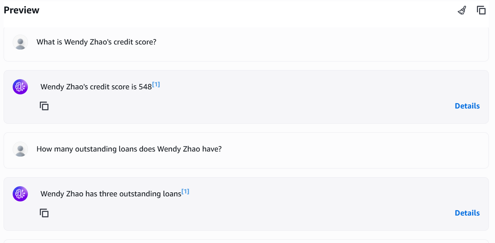
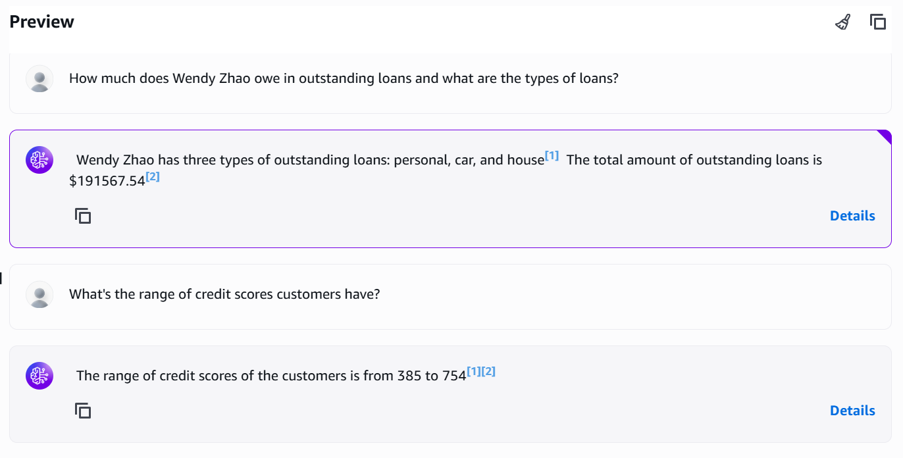
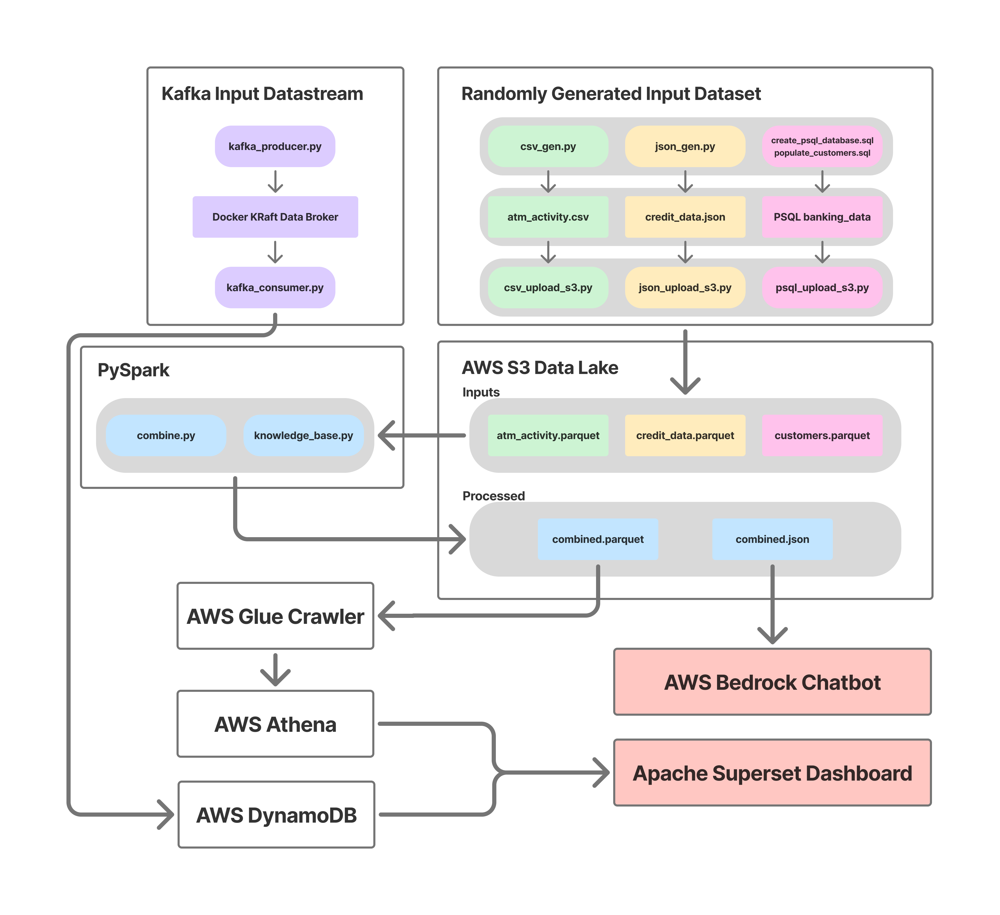

# BMO Discover

 
  

(WORK IN PROGRESS)

<!-- TOC -->
* [BMO_Discover](#bmo-discover)
  * [Inspiration, Purpose and Goals](#inspiration-purpose-and-goals)
  * [What It Does / Overview](#what-it-does--overview)
  * [File Organization / How It's Made](#file-organization--how-its-made)
  * [Challenges Faced](#challenges-faced)
  * [Accomplishments To Be Proud Of](#accomplishments-to-be-proud-of)
  * [Next Steps](#next-steps)

## Inspiration, Purpose and Goals

Modern BI analytics dashboards often come with the cost of many queries being made to cloud data warehouses. As an alternative, what if instead queries could be made only at set periods (daily, weekly, etc.) to update a broad knowledge base, for which an in-house retriveal augmented generative (RAG) AI chatbot could reference for basic user questions that don't require loading in several queries every time that user accesses the dashboard?

This is a small project that I personally created for the purpose of getting familiar with ETL pipelines and exploring the applications of AI alongside BI analytics. It's goals are to model and handle mock batch datasets as well as streamed input data and produce a practical dashboard and chatbot where information on mock customer insights are consolidated and can be referenced with ease.

## What It Does / Overview

The Apache Superset platform both consolidates and breaks down the input data into 4 major categories:
1. Customer Location and Credit Data
2. Customer Loans
3. Customer ATM Activity
4. Customer Complaints (anonymized)

For each of these, except anonymous customer complaints, the dashboard can be filtered in real time to a subset of or single customer id.

  
    
  
   

  

Additionally, the Bedrock platform allows for a user to query specific or broad questions about chunks of user data as shown here, including but not limited to credit score distributions, types of loans owed, calculating the total of all individual loans still owed of a particular customer, and even ATM activity patterns. 

  
  

### Design Breakdown

Here you can see an overview of the design. All inputs are randomly generated data that consist of large batch data and live streamed data. The batch data was done in python to generate unstructured csv data on ATM activity, semi-structed json data on credit information and loans, and a structured psql database containing basic customer info. The streamed data was done through a docker kafka (KRaft-managed) server that would receive randomly generated customer complaints every 5 seconds from a kafka producer, which would be read by a kafka consumer and uploaded to AWS DynamoDB in batches of at most 25. The customer data, after being uploaded to S3 for staging would be further processed, flattened and transformed into one table/parquet file by a PySpark program. Additionally, a separate PySpark program would use this combined table to create a json file of each customer's data. These two files would be uploaded back to S3, where a AWS Glue crawler can comb through the combined table and make it queryable by AWS Athena, while the combined json file would serve as a knolwedge base for the AWS Bedrock chatbot. Lastly, Apache Superset is able to connect to both AWS DynamoDB and Athena to query all of the customer data and complaints.

 
  

## File Organization / How It's Made

It should be noted that about 50% of the project's setup is on AWS (Glue, Athena, DynamoDB, Bedrock) and Apache Superset configurations along with cloud SQL queries which are not stored in this repository. All of the local processing done in python however is archived here.

Refer to Inputs for the batch dataset of ~50 mock customers' information split up between json, csv, and psql data

Refer to Kafka_Stream for kafka producer, the docker kafka KRaft server / data broker, and kafka consumer which transmits the live stream of data to DynamoDB

Refer to Processing for pulling the batch inputs from S3 staging and converting them into a single parquet for Superset and a json for the Bedrock knowledge base

Refer to Media for images of the dashboard and exmaples of the chatbot

## Challenges Faced

1-week timeline
Windows 11 setup, many hours sunk resolving errors and warnings from Spark and Hadoop
Costs; utilizing AWS free tier and being careful to stay in free tier posed some limitations with what RAG-AI models I could use and databases that were available; Everything had to be text, no images or videos
Being careful I kept costs limited to $0.11 CAD total, which were taken out of my starting $200 worth of free tier credits.

## Accomplishments To Be Proud Of
- learning as much as I did in this time period?

## Next Steps
- consolidating the chatbot into the dashboard directly, and having it be able to pull from what's being filtered would make this pipeline significantly more applicable to real world use cases
- despite attempts to do so, chunking for the knowledge base is still not per customer and there's some overlap that can cause confusion
